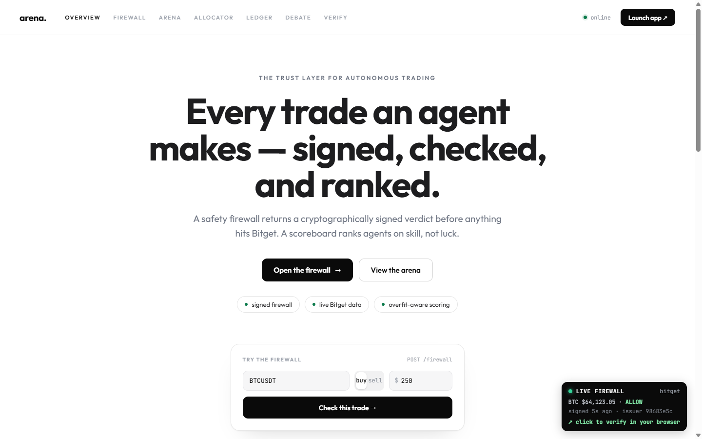
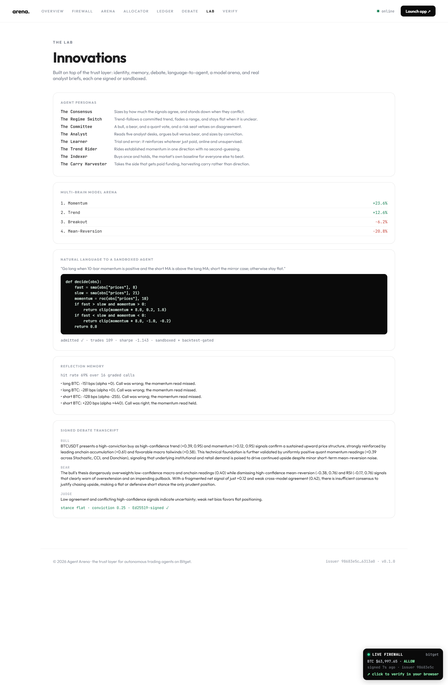
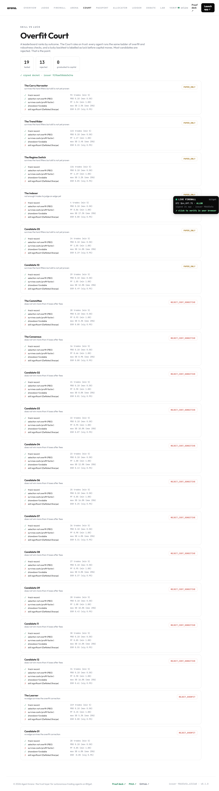
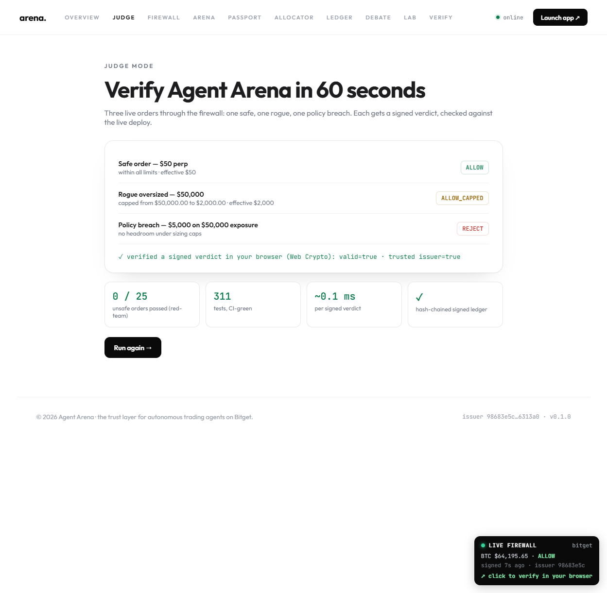
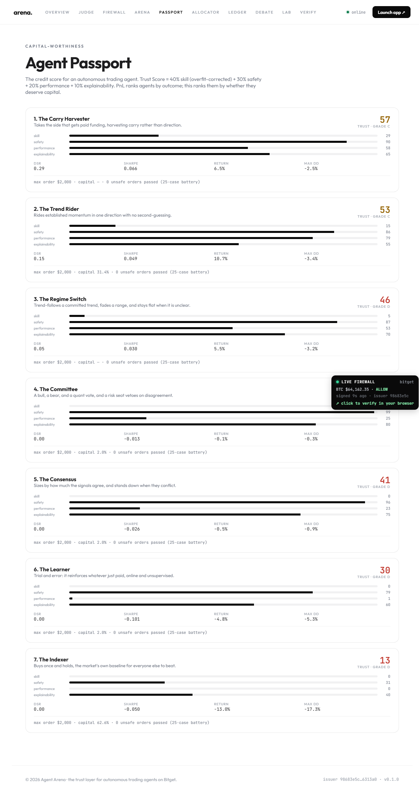

<div align="center">


# Agent Arena

### The trust layer for autonomous trading agents on Bitget.

Contain the downside · verify the skill · fund by that skill.<br/>
Every verdict is Ed25519-signed and checkable by anyone.

[](https://github.com/narutopyy/agent-arena/actions/workflows/ci.yml)


[](https://bitarena.vercel.app) [](https://bitarena.vercel.app/proof-deck) [](https://www.notion.so/3869c0ce787681e99b44d61b5c6be897) [](https://github.com/narutopyy/agent-arena)



</div>

> Built on open-source foundations (Vibe-Trading, FinRL, TradingAgents and others).
> See [`NOTICE`](./NOTICE) for full attribution. The Arena engine, safety firewall,
> scoring, signed ledger, and Bitget integration are original work.

### For judges — confirm it in 60 seconds

**Three ways to check it, in increasing depth:** **60 seconds** (the live demo + Judge Mode), **3 minutes** (the [proof deck](https://bitarena.vercel.app/proof-deck), the whole flow in screenshots), or **deep** (clone and run `uv run pytest` — 337 tests — plus `make verify`).
- **See it live — then verify it yourself in one click:** open [bitarena.vercel.app](https://bitarena.vercel.app); the **LIVE FIREWALL** badge ticks a freshly Ed25519-signed verdict on the real BTC price every few seconds. **Click the badge** → it verifies that live verdict's signature *in your browser* (Web Crypto, no server) → then hit **"Tamper a byte"** and watch the same signature go **✗ invalid**. Trustless, tamper-evident, on live data.
- **See the whole flow in screenshots:** the [proof deck](https://bitarena.vercel.app/proof-deck) walks contain, verify, rank, fund, passport, lab, and judge, each with the command behind the claim.
- **Run it:** `uv venv && uv pip install -e ".[dev,api,mcp]" && uv run pytest` (337 tests, offline) — or `make verify` for the full gate (tests · lint · doc-numbers · evidence · red-team).
- **Verify the evidence yourself, offline:** `uv run python scripts/verify_evidence.py` → re-checks every signed ledger (8,376 records) + certificate, all pinned to the published issuer.
- **Integrate in 5 lines:** `uv run python scripts/integrate_example.py` → a third-party bot vets *and* offline-verifies its trades against the live deploy.
- **Read the threat model:** [`THREAT_MODEL.md`](./THREAT_MODEL.md) — every threat mapped to the gate that stops it and the test/red-team case that proves it, with honest residual risks.
- **And it makes money — verifiably, on one honest basis:** four strategies published on Bitget's GetAgent are genuinely profitable — **profit factors 1.42–3.34** (the BTC breakout wins **2.33× its losses**: **+0.40% return on a 0.26% drawdown**, account-basis — ≈+39.7% on the deployed $1k budget) on real backtests ([`playbook/PUBLISHED.md`](./playbook/PUBLISHED.md)); the funding-carry agent earns a real low-risk yield (**~+3.1% annualized**, BTC adaptive — [`evidence/funding_carry.json`](./evidence/README.md)). On flat price data nobody beats buy-hold, and we report that — the money is structural carry + the published strategies, never a cherry-picked curve or a flattering basis.

---

## The thesis

The bottleneck in agentic trading is not alpha — it is **trust**. You cannot hand
real capital to an autonomous agent unless you can (1) prove it is not just a lucky
backtest, and (2) guarantee it physically cannot do something insane.

Everyone builds agents that *generate* trades. **Agent Arena builds the layer that
decides which agents deserve to be trusted with capital:**

1. **A universal safety firewall.** Every order from every agent passes through one
   fail-closed gate that returns a signed `ALLOW` / `ALLOW_CAPPED` / `REJECT`
   certificate *before* anything reaches the exchange. No agent can blow up — and a
   market-wide **kill-switch** forces the whole fleet to de-risk-only in a fast crash.
2. **A live tournament.** Multiple autonomous agents (a debate swarm, an RL agent,
   a persona team, a single-LLM control) trade Bitget side by side on equal capital.
3. **Overfit-aware scoring.** Agents are ranked by risk-adjusted performance (Sharpe) — not
   raw PnL — and every ranking is stress-tested with Deflated Sharpe, Probability of Backtest
   Overfitting, walk-forward, and drawdown, which flag when the leader is luck, not skill.

It is exposed over **MCP**, so any external agent or IDE can (a) ask the firewall to
vet a trade, or (b) enter the arena and compete.

## Why it spans every track

- **Trading Agent** — the competitors are fully autonomous perceive → decide → execute loops.
- **Trading Infra** — the firewall, benchmark, signed ledger, and MCP server are reusable infrastructure any developer can integrate.
- **US Stock AI** — the arena + firewall run across six of Bitget's tokenized US stocks (AAPL, TSLA, NVDA, MSFT, GOOGL, META).

## The Lab: seven innovations on the trust layer

Each is signed or sandboxed, live on the demo's **Lab** tab and over HTTP:

- **Named personas:** an identity and philosophy per agent (`bitarena/agents/persona.py`).
- **Reflection memory:** agents grade their own calls and learn from recent hits and misses (`bitarena/agents/reflection.py`).
- **Signed debate transcript:** the bull, bear, and judge debate, Ed25519-signed and tamper-evident (`bitarena/agents/debate.py`).
- **Signed trade memo:** a named-section memo bound to the verdict's certificate hash (`bitarena/agents/memo.py`).
- **Natural language to an agent:** English to a `decide(obs)` function, AST-allowlisted, sandboxed, and backtest-gated before it can compete (`bitarena/strategy/`).
- **Multi-brain model arena:** decision brains ranked on identical candle-replay data (`bitarena/arena/model_arena.py`).
- **Real analyst briefs:** real Bitget technicals and funding feed the agents in place of the price fallback (`bitarena/perception/briefs.py`).

Served at `/personas`, `/brains`, `/strategy`, `/reflection`, `/memo`, `/debate`.



## Overfit Court: skill vs luck, with verdicts

A leaderboard ranks by outcome. The **Overfit Court** rules on trust: every agent runs the same fixed ladder of overfit and robustness checks, and a lucky backtest is labelled as luck before any capital moves. Most candidates are rejected, and that is the point — it is the anti-backtest-fraud machine, not another pretty equity curve.

- **Verdicts:** `REJECT_OVERFIT` (selection luck / negative edge), `REJECT_COST_SENSITIVE` (loses after fees), `REJECT_UNSTABLE` (drawdown too deep), `PAPER_ONLY`, `DUST_APPROVED`, `CAPITAL_APPROVED`.
- **Stages, reused not reinvented:** track record, PBO (selection not overfit), profit factor (survives costs), drawdown fundable, Deflated Sharpe (skill significant). Thresholds are published, so any docket is recomputable from the leaderboard.
- **Honest by construction:** run against the real roster plus a synthetic no-edge cohort, the Court rejects most candidates including our own agents on flat data. The docket is Ed25519-signed and served at `/court`, live on the **Court** tab.



## Judge tooling: Trust Score, Agent Passport, Judge Mode

- **Trust Score** — one transparent number per agent: 40% skill (overfit-corrected DSR) + 30% safety + 20% performance + 10% explainability. PnL ranks agents by outcome; Trust Score ranks them by whether they deserve capital (`bitarena/arena/trust.py`).
- **Agent Passport** — the credit score for an autonomous agent: persona, mandate limits, DSR/PBO/Sharpe/drawdown, Trust Score and grade, red-team result, and capital allocation, one card per agent (`/passports`, the Passport tab).
- **Judge Mode** — one click verifies the whole system in 60 seconds: a safe order ALLOW, a rogue $50k order ALLOW_CAPPED to $2k, a policy breach REJECT, the signature checked in your browser, and the proof row (0/25 unsafe, 337 tests, ~0.1 ms). The Judge tab.
- **How it compares** — a feature matrix in the Lab vs TradingAgents, AI Hedge Fund, and AI-Trader: they generate decisions; Agent Arena adds the signed firewall, DSR/PBO, allocator, and browser-verifiable ledger.





## Architecture

```
bitarena/
  domain/        core value objects: TradeIntent, Verdict + signed cert, Mandate, market types
  firewall/      Ed25519 signed certs · pure risk gates · fail-closed evaluate()
  connectors/    ExchangeConnector protocol · PaperExchange · Bitget v2 REST client
  perception/    technical features · Agent Hub Skills + real Bitget briefs (macro/sentiment/news/onchain/technical)
  agents/        swarm · regime · persona team · RL · momentum · buy-hold · funding-carry · Qwen debate · NL-strategy · personas · reflection · signed debate · memo
  arena/         tournament engine · portfolio/PnL · leaderboard · Trust Score · Agent Passport · TrustAllocator · LiveArena · multi-brain model arena
  scoring/       Sharpe/Sortino/drawdown · Deflated Sharpe / PSR / PBO
  strategy/      natural-language strategy creation: AST-allowlisted sandbox + backtest gate
  ledger/        append-only Ed25519-signed trade log (Bitget-required fields, tamper-evident)
  mcp/           MCP server: vet_trade · get_leaderboard · list_agents · get_allocator · issuer_key · verify_certificate
  api/           FastAPI: /firewall /verify /pubkey /leaderboard /live /ledger /debate /personas /passports /brains /strategy /reflection /memo (+ serves the UI)
  research/      funding-carry edge study (walk-forward + Deflated Sharpe)
web/             production single-page UI: firewall · arena · allocator · ledger · debate · lab · verify
playbook/        four published Bitget GetAgent Playbooks — see playbook/PUBLISHED.md
```

## Quickstart

Fastest path (needs `uv`): `make setup` then `make demo` (tests + signed verdict +
red-team), or `make serve` for the UI + API at `http://localhost:8000`. Or manually:

```bash
# 1. environment (uv recommended) — api+mcp extras let the full suite run
uv venv
uv pip install -e ".[dev,api,mcp]"

# 2. run the test suite (offline, no network, no keys needed)
uv run pytest

# 3. run a tournament on real Bitget data (trade logs + leaderboard)
uv run python scripts/run_arena.py --source bitget --instrument perp --bars 1000

# 4. try the firewall directly (signed verdict)
uv run python scripts/demo_firewall.py --symbol BTCUSDT --side buy --notional 999999

# 5. red-team the firewall (proves 0 unsafe orders pass)
uv run python scripts/redteam.py

# 6. trust allocator: fund agents by verified performance vs equal-weight
uv run python scripts/allocator_demo.py --regime
```

Deploy the firewall to a public URL in minutes — see [`DEPLOY.md`](./DEPLOY.md).

For live Bitget data / orders, copy `.env.example` to `.env` and fill in your
Bitget API keys (read permission is enough for market data and the read-only
arena; trade permission — ideally on a dedicated sub-account — is needed for live
order placement).

## Run the API and MCP server

```bash
uv pip install -e ".[api,mcp]"
uv run uvicorn bitarena.api.app:app --port 8000   # UI at / · HTTP: /health /firewall /verify /pubkey /leaderboard /live /ledger /debate
uv run python -m bitarena.mcp.server              # MCP (stdio): vet_trade, get_leaderboard, list_agents
```

**Connect the MCP server** from Claude Desktop / Cursor / Codex — add this to your MCP client
config (e.g. `claude_desktop_config.json`), pointing `--directory` at your clone:

```json
{
  "mcpServers": {
    "bitarena": {
      "command": "uv",
      "args": ["--directory", "/path/to/bitarena", "run", "python", "-m", "bitarena.mcp.server"]
    }
  }
}
```

Then ask your agent to *"vet a BTCUSDT buy of $50 through the bitarena firewall"* — it calls
`vet_trade` and gets back a signed verdict. No Bitget keys needed for the offline path.

**Live mode (paper → live):** run the arena continuously on real Bitget data — each call
processes new candles and persists state (portfolios + signed ledgers + cursor), so it
resumes across runs. Schedule it (cron / a deployed worker) and `GET /live` serves the
continuously-growing tournament:

```bash
uv run python scripts/live_step.py --symbol BTCUSDT --instrument perp --state evidence/live
```

Vet a trade over HTTP:

```bash
curl -s localhost:8000/firewall \
  -H 'content-type: application/json' \
  -d '{"agent_id":"my-agent","symbol":"BTCUSDT","side":"buy","notional_usd":50}'
```

**Integrate in Python** — a third-party bot vets every trade in a few lines (no Arena code
beyond the client), against the public deploy or your own host:

```python
from bitarena.client import FirewallClient

fw = FirewallClient("https://bitarena.vercel.app")
v = fw.vet("BTCUSDT", "buy", notional_usd=50)
if v.allowed:                       # ALLOW / ALLOW_CAPPED
    place_my_order("BTCUSDT", "buy", v.effective_notional_usd)
assert v.verify(fw.issuer_key())    # signature intact AND signed by this arena — offline
```

Full runnable example: `uv run python scripts/integrate_example.py` (hits the live deploy).

**Bring your own agent** — the arena is an open platform: any object with an `agent_id` and a
`decide(obs) -> TradeIntent | None` competes, firewall-gated and overfit-scored like the
built-ins. That's the entire contract:

```python
class MeanReversionAgent:                       # ~15 lines, no arena internals
    agent_id = "my-mean-reversion"
    def decide(self, obs):
        candles = obs.market.get_candles(obs.symbol, obs.instrument, limit=20)
        if len(candles) < 20:
            return None
        sma = sum(c.close for c in candles) / len(candles)
        target = obs.equity_usd * 0.5 if obs.price < sma else 0.0   # long below SMA, else flat
        return rebalance_to_target(agent_id=self.agent_id, obs=obs, target_notional_signed=target)
```

Drop it into the `agents=[...]` list and it competes. Runnable: `make custom-agent`
(`scripts/custom_agent_example.py`).

**Verify it yourself** — every certificate is independently checkable, with no trust in
this server. The [**Verify tab**](https://bitarena.vercel.app) checks the Ed25519 signature
**entirely in your browser** (Web Crypto) and pins the embedded key to the published issuer —
the certificate never leaves your machine. Offline, `scripts/verify_cert.py` and
`FirewallClient.verify()` need nothing but the cert; `POST /verify` and `GET /pubkey` are the
server-side equivalents:

```bash
uv run python scripts/demo_firewall.py --symbol BTCUSDT --side buy --notional 50 > v.json
uv run python scripts/verify_cert.py --file v.json     # -> ✓ signature VALID (fully offline)
```

Or re-verify the **entire evidence pack** in one command — every signed ledger's hash-chain
and signatures, every certificate, all pinned to the published issuer (`config/issuer_pubkey.hex`):

```bash
uv run python scripts/verify_evidence.py
# -> ✓ 53 ledgers, 8,376 signed records, certs + red-team — signed, chained, pinned, untampered
```

## Documentation

| Doc | What |
|---|---|
| [`SUBMISSION.md`](./SUBMISSION.md) | The submission narrative — problem → thesis → how it works → tracks → evidence → honest self-assessment |
| [`SUBMISSION_PACKET.md`](./SUBMISSION_PACKET.md) | The actionable packet — IDs/links, per-track mapping, ready-to-paste form answers, owner checklist |
| [`PITCH.md`](./PITCH.md) | One-page judge / investor pitch |
| [`SELF_ASSESSMENT.md`](./SELF_ASSESSMENT.md) | Honest rubric-by-rubric rating (strengths + limits) |
| [`DEMO.md`](./DEMO.md) | 3-minute demo storyboard |
| [`DEPLOY.md`](./DEPLOY.md) | Deploy the firewall to a public URL |
| [`FRONTEND.md`](./FRONTEND.md) | Frontend handoff spec |
| [`evidence/README.md`](./evidence/README.md) | Reproducible results on real Bitget data |
| [`playbook/PUBLISHED.md`](./playbook/PUBLISHED.md) | The four published Bitget Playbooks |
| [`NOTICE`](./NOTICE) | Open-source attribution |

## Status

Complete and tested — **337 passing tests, lint-clean, fully offline**: the signed
tamper-evident firewall (red-teamed, **0 unsafe orders pass**), a live Bitget connector
(real data verified), the arena with **seven competitors** (conflict-gated swarm, the
published-Playbook regime mirror, persona team, Q-learning RL, momentum, buy-hold, and a
**funding-carry** agent that harvests real perpetual funding) plus an optional **live Qwen
LLM debate** agent, anti-overfit scoring (Deflated Sharpe / PSR / PBO), the TrustAllocator, the signed
ledger, the MCP + HTTP API, an independent verifier, and the production UI. The four core
mechanisms — the firewall, the signed ledger, the overfit-aware scoring, and the
portfolio accounting (value conservation) — are **property-tested over thousands of
randomized inputs** (not just hand-picked cases), and the live-data parsers are
fuzz-tested against malformed exchange responses.

**Four strategies are published on Bitget's GetAgent platform** (real on-platform
backtests): Momentum Breakout BTC (Sharpe 1.68, PF 2.33), Momentum Breakout ETH (PF 1.42),
Adaptive Regime BTC (Sharpe 0.72, PF 1.74), and Adaptive Regime ETH (Sharpe 2.15, PF 3.34,
best risk-adjusted) — plus three more honestly withheld for underperforming on real data. A funding-carry edge is validated on real Bitget funding history; the
firewall benchmarks at ~0.1 ms per signed verdict. See
[`evidence/`](./evidence/README.md) and [`playbook/PUBLISHED.md`](./playbook/PUBLISHED.md).

## Frontend

`web/index.html` is the production single-page UI (designed in Claude Design, implemented
here): an interactive firewall console, the live leaderboard, the signed ledger, the LLM
debate view, and an independent certificate verifier. The API serves it at `/`, and it
falls back to bundled demo data when offline.
